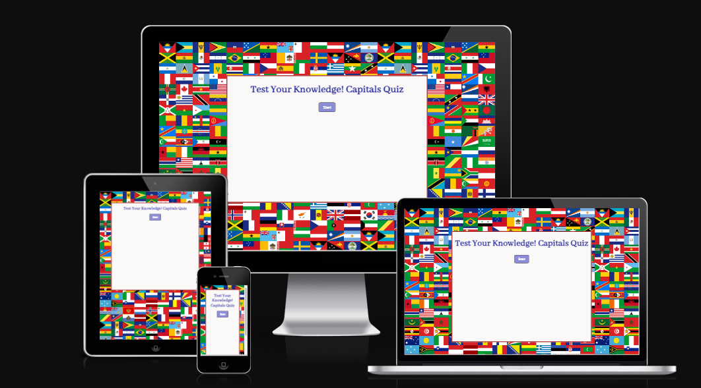

# Capitals Quiz
## Description 
Capitals Quiz is an online Quiz designed to allow the user to test his knowledge about the worlds capitals. The Quiz is created in a very interactive and intuitive manner that would make it very accesible and entertaining. 

### User Stories
  * As a user I would like to test my knowledge about world's capitals

## Features
### Existing Features
  * Capitals Quiz Heading 

As the page has uploaded the user is presented with a large title area that is designed to caption his atention and interest.

  * The Start Button

After getting intrigued by the title user should be already willing to play the game, and this can be easily done by pressing on the start button. 

  * Question Section

Once user has started the game, he will be presented with one question per page, that will have three answer options, from which he can chose then submit his answer. 

  * The Score Area

After submitting his answer a text will appear to say if answer was correct and if contrary to say which was the correct answer. Also underneath this text there is a section that will allow the user to see exactly how many correct and incorrect answers they have provided.

  * Next button

Aside of the submit button, there is a Next button, which can be pressed only after submitting an answer, and this will take user to next question or at the end of the game when questions have finished. 

  * End of Game

When questions have ended user will be presented with his final score, and then have the option to play the quiz again on pressing Restart button. 

### Features Left to Implement

In time the site should allow the user to create an account and play against time and other users.

## Typography and colour scheme
Page has a fairly simple appearence. Backround is created by an image with different flags, then text area is fitted inside a white container. Text colours have been specified in CSS by rgb(red,green,blue) values. 
 
## Testing
* Step I: pressing on Start button will show first question and options.
* Step II: once an answer is selected by user Submit button will appear
* Step III: once Submit button is pressed, answer selected gets checked - a message will appear for the user, score will get incremented, and now Submit button will dissapear and Next button will show up 
* Step IV: once all questions are finished, user will be shown final score and a Restart button which if pressed page will be uploaded and user can start playing game again

Capitals Quiz Project looks and works well on different browsers and screen sizes.

### Validator Testing
#### HTML

No errors were returned when passing through the official W3C validator.

#### CSS

No errors were returned when passing through the official W3C CSS validator.

#### JavaScript

No errors were found when passing through the official Jshint validator.
Metrics
* There are 5 functions in this file.

* Function with the largest signature take 1 arguments, while the median is 0.

* Largest function has 13 statements in it, while the median is 4.

* The most complex function has a cyclomatic complexity value of 6 while the median is 1.

### Fixed Bugs 

## Deployment
The site was deployed to GitHub pages. The steps to deploy are as follows:
  * In the GitHub repository, navigate to the Settings tab
  * From the source section drop-down menu, select the Master Branch
  * Once the master branch has been selected, the page will be automatically refreshed with a detailed ribbon display to indicate the successful deployment.

## Credits
### Content
The information has been taken from  [Wikipedia](https://en.wikipedia.org/wiki/List_of_national_capitals).

### Media
Flags image has been taken from [Flags](https://www.google.com/url?sa=i&url=https%3A%2F%2Fworld-geography-games.com%2Fen%2Fflags_world.html&psig=AOvVaw3MyrGIyn8J7m60q5d6ooqm&ust=1665961816204000&source=images&cd=vfe&ved=0CA0QjhxqFwoTCOCLrMSt4_oCFQAAAAAdAAAAABAE)

JavaScript code has been written with inspiration from:
* [YouTube]](https://www.youtube.com/watch?v=riDzcEQbX6k)
* [Google Page](https://simplestepscode.com/javascript-quiz-tutorial/)

